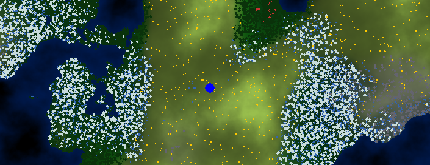

    

# Table of Contents

- [Project Overview](#project-overview)
- [How It Works](#how-it-works)
- [Technologies Used](#technologies-used)
- [The Team](#the-team)

# Project Overview

<h4 align="center">
  WGen-2D: A Deterministic Climate Simulation
</h4>

## Problem

Most procedural generation in games relies on simple randomness or "noise" (like Perlin Noise) to place biomes. This often results in a "fruit salad" map where deserts sit next to glaciers, or rainforests appear without any water source. While this creates infinite worlds, they often lack geographical logic, realism, and immersion.

## Solution

**WGen-2D** creates an infinite world based on **Planetary Physics**, not just randomness. Instead of painting biomes directly, we simulate the *causes* of biomes. The engine generates altitude, simulates a global wind vector field, and traces moisture from the oceans to calculate rainfall and rain shadows.

The result is a world where deserts form naturally behind mountains, forests grow in wet coastal valleys, and flora (like trees, cacti, and flowers) is placed deterministically based on specific "biological" density rules.

# How It Works

1.  **Geometry:** We use Perlin Noise to generate an infinite base terrain (Altitude).
2.  **Wind Simulation:** We generate a continuous global Vector Field to simulate wind currents.
3.  **Climate Engine:** We use a "Reverse Trace" algorithm. For every pixel, we trace the wind backward. If it comes from the ocean, it brings rain. If it hits a mountain, it creates a **Rain Shadow** (Desert).
4.  **Biology:** We use a Whittaker Diagram to combine Temperature and Precipitation to select the correct Biome.
5.  **Object Placement:** A deterministic hashing system places trees, rocks, and flowers, ensuring that the infinite world is always consistent, even when revisited.

## Technologies Used

-   **Python** – The core logic and simulation engine.
-   **Pygame** – Used for real-time rendering, chunk management, and the visual interface.
-   **NumPy** – Utilized for high-performance vectorized calculations (managing 1024 pixels per chunk instantly).
-   **SciPy** – Used for optimization techniques like Bilinear Interpolation to upscale climate data.

# The Team
<h4 align="center">
  Procedural Generation Engineers
</h4>
<table align="center">
  <tr>
    <td align="center">
      
       
      <b>Francisco Cardoso</b>
    </td>
    <td align="center">
      
       
      <b>José Martins</b>
    </td>
    <td align="center">
      
       
      <b>Cedric Hartz</b>
    </td>
  </tr>
</table>