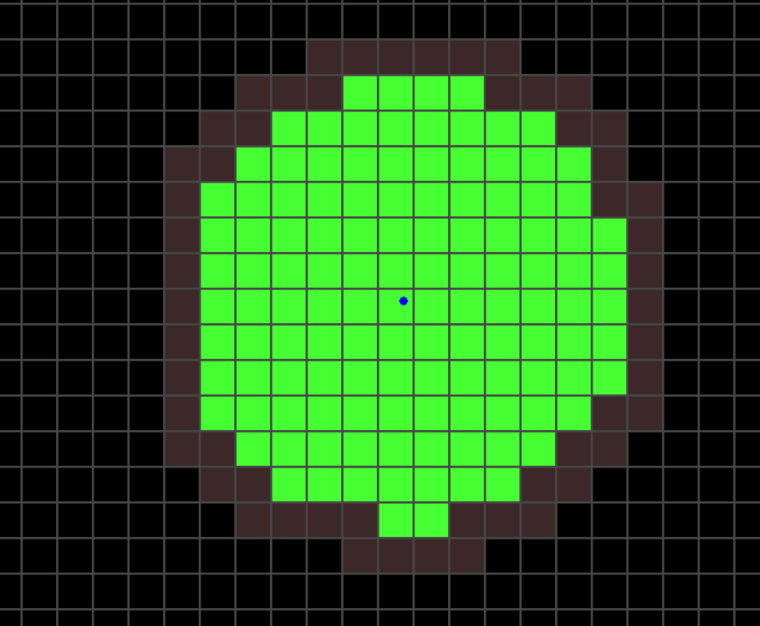

<b>Procedural Generation of a Coherent Infinite 2D Landscape</b>
 
(Final Report)
 
José Martins, Francisco Cardoso, Cedric Hartz

## Abstract

This project explores procedural content generation of an infinite 2D top-down world using a chunk-based approach. The generated world is composed of different biomes, derived from multiple environmental maps (i.e., altitude, temperature, precipitation), focusing on local and regional consistency and coherency. The goal is to study how noise-based algorithms mixed with rule-based decisions can produce large-scale worlds with smooth biome transitions and context-aware content placement.

## Introduction

Many videogames are centered around a large world, in which players can fight, accomplish quests, explore and maybe build their own structures. Game developers therefore face the need to create such a large map for the game to take place. This is not an easy task, especially for small studios and teams, and consumes time and money. This is why the demand for PTG (procedural terrain generation) is ever increasing.

The main challenge for PTG is to create a coherent and structured world, that does not look purely random. While different games adopt different approaches, they often share the same underlying goal: ensuring that the generated world makes sense according to its own internal rules.

Looking at Minecraft as a well known example for PTG, its infinite world is composed of biomes that transition in a consistent and recognizable way, while RimWorld divides its world into multiple regions that may repeat biomes or patterns. These worlds do not necessarily follow real-world planetary rules, but they maintain internal consistency that makes them believable and playable.

Observing how such games balance repetition, large-scale structure, and local detail motivated us to explore similar ideas. This project focuses on understanding how coherence can be preserved in an infinite world, valuing coherence over realism. To preserve flexibility and usability of the generation, we plan to make use of relatively simple mechanisms such as continuous noise fields, simple physics-based approaches and rule- and probability-based decisions. The constraint of generating an infinite world requires a real-time performant generation and forces us to implement simulations and decisions relying only on local data, instead of a full global simulation.

## Related Work

[Todo:
- literature
- introduce our main source (AutoBiomes) and explain how we can use the presented methods for our project, but still have to modify them to be infinitely scalable

]

## Methodology of our approach

### Chunks

The most important aspect of generating and managing an infinite world is the chunk loading. As it is not possible to generate and load the entire map, the world is divided into rectangular chunks of fixed size and our generation engine only loads and generates a certain subset of chunks around the player.

When generating a singular chunk, the problem arises that the surrounding chunks might not exist yet and cannot serve as a basis for the generation of the current chunk. If we forced the neighboring chunks to generated first, we run into a problem of recursion. Our solution is to define two phases for the chunk generation:

1. The chunk object is created. Accomplishing this phase is possible without creating the surrounding chunks.
2. The chunk is generated. For this, we do need the surrounding chunks, but it suffices to have the surrounding chunks created. 

The following image shows the player as a blue dot in the middle, the generated chunks in green, the created chunks in dark red and the non-existing chunks in black:

### Noise

Next, we followed the pipeline used by AutoBiomes, which consists of synthetically generating the base terrain using random noise, simulating climate in the environment lastly placing the assets. 

Our code follows this model by implementing multiple environment maps for each chunk. An environment map is a numpy array, which maps a 2d chunk coordinate to a value. The environment maps that we define are:

- altitude: fractal simplex noise. We applied a reshaping function to the noise to increase the realism and playability of the terrain.
- temperature: fractal simplex noise
- wind: [Todo]
- precipitation: [Todo]
- biomes: Each coordinate of the chunk receives a probability vector (sums to 1) that has a size equal to the number of biomes.

The altitude and temperature maps are synthetic noise maps. They form the foundation for the physics-based generation of precipitation and therefore for the placement of biomes. We applied a reshaping function $[0,1] \rightarrow [0,1]$, which accentuates high values to make mountains higher and it clumps together values around 0.5, to produce more plateaus. This function can be freely exchanged to create different terrain.

### Physics-based simulation of wind and precipitation

[Todo: 
- wind and precipitation
- remember to do justification and reasoning

]

### Biomes

Altough biomes do not closely mode the real world, they are a useful abstraction and help the asset placement to feel more natural and coherent. As described in the introduction, the videogame Minecraft uses biomes. A desert for example contains sand, cacti and desert temples, which work well together to give the environment a unique ambience and make the world feel logical. However, Minecraft suffers from clear biome boundaries, which break the immersion and make the world feel unrealistic and forced.

Our goal is to generate a coherent landscapes. To do so, we do not assign a single biome to every chunk or coordinate of the world, but instead calculate a probability distribution. Each coordinate of our world is assigned a probability vector (whose entries sum to 1) of size equal to the number of biomes. This resulting biome-map is continuous and allows us to blend between two and more biomes smoothly, so that biomes can fade in and out.

[Todo: rule based assignment of biomes + blending]

### Content placement

[Todo]

## Evolution of our methodology

[Todo: 
- possibly failed attempts, evolution of our approach

]

## Experiments and Results

[Todo:
- (we still have to do the experiments)
- describe what we did
- what are the results?
- how are they useful, how can they be applied in different contexts, in the real world, by other people?

]

## How to run our generator

[Todo:
- how to run the code
- what do you have to know about the generator

]

## Conclusion

[Todo:
- overview of our results
- what is different from our initial plan

]

### Future work

[Todo]

## Appendix

[Todo:
- images, diagrams, useful information

]